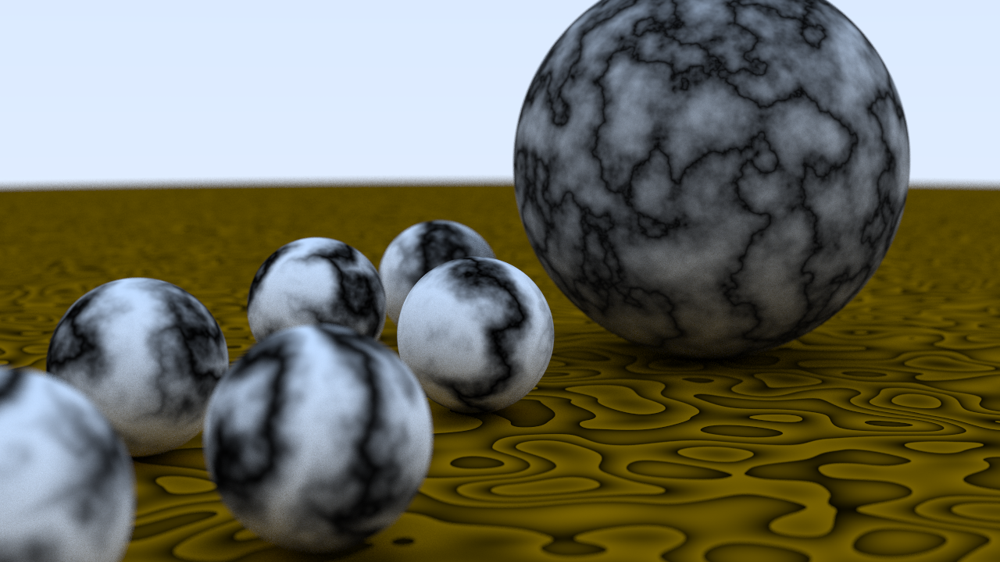

This is yet another follow-along of Peter Shirley's [Ray Tracing in One Weekend](https://raytracing.github.io/books/RayTracingInOneWeekend.html) series, with a few more bells and whistles such as multithreading and an SDL window.
Some parts of the second book were quite opaque, and these articles by Scratchapixel helped a ton:

- [Interpolation](https://www.scratchapixel.com/lessons/mathematics-physics-for-computer-graphics/interpolation)
- [Procedural noise](https://www.scratchapixel.com/lessons/procedural-generation-virtual-worlds/procedural-patterns-noise-part-1)

```
Usage: rtc [OPTION...]
Another Peter Shirley Ray Tracer clone

  -c, --scene=SCENE_NUM      Select a scene to render
  -d, --maxdepth=MAX_DEPTH   The maximum recursion depth when bouncing rays
  -f, --file=FILENAME        Save to a PNG file instead of viewing it in a
                             window
  -l, --listscenes           List available scenes
  -r, --res=RESOLUTION       Initial screen resolution, e.g. 1280x720
  -s, --samples=NUM_SAMPLES  Number of samples per pixel
  -t, --numthreads=NUM_THREADS   Number of threads to use, defaults to 1
  -?, --help                 Give this help list
      --usage                Give a short usage message

Mandatory or optional arguments to long options are also mandatory or optional
for any corresponding short options.
```




